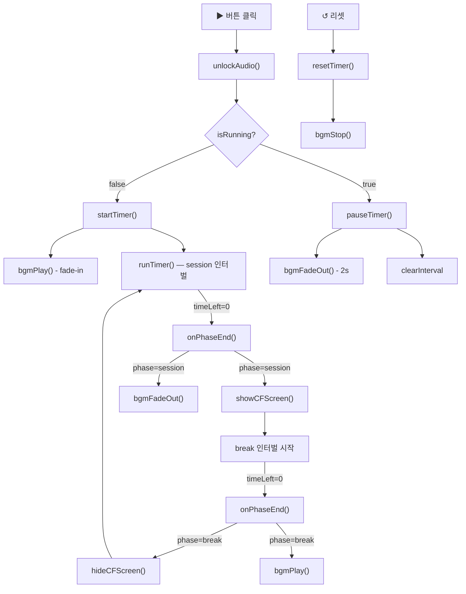

# TV 컨셉 보강 — 상세 설계서 (개정판 v2)

> 작성일: 2026-06-09 | 개정일: 2026-06-09  
> 수정 대상 파일: `bgm.js`(신규), `timer.js`, `index.html`, `style.css`  
> 격리 구역 (절대 수정 금지): `cf.js`, `track.js`, `progress5.js`, `subtitle.js`, `tuning.js`, `storage.js`

---

## 변경 이력

| 버전 | 변경 내용 |
|---|---|
| v1 | 초안 — BGM 추가 + CF 이미지화 + 마이그레이션 설계 |
| v2 | CF 이미지화 전면 취소 (cf.js 격리 구역 편입), TV UI 스케일업 설계 추가 |

### v2 취소 항목

`cf.js`에 이모지·텍스트 직접 편집 기능이 완벽하게 구현되어 있음을 확인. 아래 항목은 v2부터 설계에서 완전 제거된다.

- `imageUrl` 데이터 구조 마이그레이션
- localStorage v1→v2 마이그레이션 방어 로직
- `showCFScreen()` 이미지 교체
- `renderCFEditor()` / `saveCFEdits()` / `addCFItem()` 수정
- `assets/images/` 폴더 및 이미지 파일 준비

---

## 0. 현황 분석 (기존 코드 동작 원리)

### 0-1. 스크립트 로드 순서 및 의존성

```
storage.js → tuning.js → progress5.js → timer.js → track.js → subtitle.js → cf.js → sound.js → setup.js
```

`timer.js`는 `cf.js`·`sound.js`보다 먼저 로드되지만, 버튼 클릭·인터벌 콜백 시점에 이미 모든 스크립트가 로드되어 있다.  
기존 팀 코드는 `if (typeof showCFScreen === 'function')` 패턴으로 느슨하게 결합되어 있다. **새로운 BGM 함수도 동일한 패턴으로 호출한다.**

### 0-2. `sound.js` 동작 원리

- Web Audio API(`AudioContext`) 기반 오실레이터 합성 방식
- `getAudioContext()` — 싱글턴 lazy-init
- `playBellSound()` — 220·440·660 Hz 사인파 3개를 4초에 걸쳐 감쇄
- `unlockAudio()` — 브라우저 AudioContext 잠금 해제 (btn-start 클릭 시 호출)

### 0-3. `cf.js` 동작 원리 (참고용 — 수정 없음)

- `CF_STORAGE_KEY = 'cfItems'` — localStorage 키
- `DEFAULT_CF_ITEMS` — `{ id, emoji, text }` 5개 배열 (구조 유지)
- `showCFScreen()` — `.tv-screen` 자식 요소를 숨기고 `#cf-overlay` div를 동적 생성
  - `#cf-emoji`: `font-size: 48px` inline style로 이모지 렌더
  - `#cf-text`: `font-size: 14px` inline style로 텍스트 렌더
- UI 스케일업은 `style.css`에서 `#cf-emoji`, `#cf-text` 선택자로 덮어쓴다 (cf.js 수정 불필요)

### 0-4. `style.css` 현재 주요 수치

| 선택자 | 속성 | 현재값 | 스케일업 목표 |
|---|---|---|---|
| `.timer-display` | `font-size` | `56px` | `120px` (2.1x) |
| `.timer-area` | `padding` | `24px 20px` | `12px 20px` (여백 축소) |
| `.subtitle-text` | `font-size` | `10px` | `17px` |
| `.subtitle-bar` | `min-height` | `28px` | `46px` |
| `.subtitle-bar` | `padding` | `6px 14px` | `10px 18px` |
| `.subtitle-dot` | `width/height` | `5px / 5px` | `8px / 8px` |

`#cf-emoji`와 `#cf-text`는 현재 `cf.js`에서 inline style로만 설정됨.  
`style.css`에 선택자를 추가하면 inline style보다 specificity가 낮으므로, CSS에서 `!important` 없이 덮어쓰려면 specificity를 맞춰야 한다.  
**해결책**: `cf.js`의 inline style에서 font-size를 제거하는 대신, CSS `#cf-emoji`, `#cf-text` 선택자만 추가한다 — cf.js의 구조 로직(display, position, transition 등)은 보존하고 `font-size` 한 줄만 삭제한다.

> 단, 이것도 cf.js 수정에 해당하므로 아래 §2-3에서 별도로 최소 수정 방침을 명시한다.

### 0-5. `timer.js`의 Phase 전환 흐름

```
[session 실행중]
    ↓ onPhaseEnd()  →  showCFScreen()  →  [break 실행중]
    ↓ onPhaseEnd()  →  hideCFScreen()  →  [session 실행중]

pauseTimer() : isRunning = false (btn-start 토글 / btn-stop)
resetTimer() : phase 초기화, CF 화면 숨김
startTimer() : sessionStartTime 기록, runTimer() 호출
```

---

## 1. BGM 아키텍처 결정

### 1-1. 결정: `bgm.js` 신규 파일 분리 (sound.js에 통합하지 않음)

| 판단 기준 | sound.js 통합 | bgm.js 신규 |
|---|---|---|
| 기술 패러다임 | Web Audio API 오실레이터 합성 | `<audio loop>` HTML 엘리먼트 |
| AudioContext 공유 | `audioCtx` 싱글턴 오염 위험 있음 | 완전 독립 |
| 팀원 코드 보호 | bell 로직 수정 필요 | 기존 sound.js 무수정 |
| 테스트 독립성 | BGM 교체 시 bell 로직 재검증 필요 | 독립 교체 가능 |

**결론**: `sound.js`는 벨 사운드 전담, `bgm.js`는 BGM 전담으로 단일 책임 원칙(SRP)을 적용한다.

### 1-2. BGM 제어 포인트 매핑

| 발생 위치 (timer.js) | 트리거 | BGM 동작 |
|---|---|---|
| `startTimer()` | ▶ 버튼 (세션 시작/재개) | `bgmPlay()` — fade-in 재생 |
| `pauseTimer()` | ▶ 버튼 (일시정지) / ⏹ 버튼 | `bgmFadeOut()` — 2초 fade-out 후 pause |
| `resetTimer()` | ↺ 버튼 | `bgmStop()` — 즉시 정지 + 볼륨 초기화 |
| `onPhaseEnd()` session→break 분기 | 세션 카운트다운 종료 | `bgmFadeOut()` — 휴식 화면 전환 전 fade |
| `onPhaseEnd()` break→session 분기 | 휴식 카운트다운 종료 | `bgmPlay()` — 세션 재개 시 fade-in |

### 1-3. `bgm.js` 핵심 코드 스니펫

```javascript
'use strict';

const BGM_DEFAULT_VOLUME = 0.28;  // 로파이 BGM은 배경이므로 낮게 설정
const BGM_FADE_DURATION_MS = 2000;
const BGM_FADE_IN_DURATION_MS = 1500;

let bgmAudio = null;
let bgmFadeTimer = null;

function _getBgmAudio() {
  if (!bgmAudio) {
    bgmAudio = new Audio('assets/audio/lofi_bgm.mp3');
    bgmAudio.loop = true;
    bgmAudio.volume = 0;
    bgmAudio.onerror = () => {
      console.warn('[BGM] 오디오 파일 로드 실패 — BGM 기능 비활성화');
      bgmAudio = null;
    };
  }
  return bgmAudio;
}

// 세션 시작 / 휴식→세션 전환 시 호출
function bgmPlay() {
  const audio = _getBgmAudio();
  if (!audio) return;
  _clearFade();
  if (audio.paused) {
    audio.play().catch(e => console.warn('BGM 재생 실패:', e));
  }
  _fadeVolume(audio, audio.volume, BGM_DEFAULT_VOLUME, BGM_FADE_IN_DURATION_MS);
}

// 일시정지 / 세션→휴식 전환 시 호출
function bgmFadeOut(durationMs = BGM_FADE_DURATION_MS) {
  if (!bgmAudio || bgmAudio.paused) return;
  _clearFade();
  _fadeVolume(bgmAudio, bgmAudio.volume, 0, durationMs, () => {
    bgmAudio.pause();
  });
}

// 리셋 시 호출 — 즉시 정지 + 처음부터 준비
function bgmStop() {
  _clearFade();
  if (!bgmAudio) return;
  bgmAudio.pause();
  bgmAudio.currentTime = 0;
  bgmAudio.volume = 0;
}

function _fadeVolume(audio, fromVol, toVol, durationMs, onComplete) {
  const steps = 30;
  const stepMs = durationMs / steps;
  const delta = (toVol - fromVol) / steps;
  let step = 0;
  bgmFadeTimer = setInterval(() => {
    step++;
    audio.volume = Math.min(1, Math.max(0, fromVol + delta * step));
    if (step >= steps) {
      _clearFade();
      audio.volume = toVol;
      if (typeof onComplete === 'function') onComplete();
    }
  }, stepMs);
}

function _clearFade() {
  if (bgmFadeTimer) {
    clearInterval(bgmFadeTimer);
    bgmFadeTimer = null;
  }
}
```

### 1-4. `timer.js` 수정 스니펫 (추가 5줄)

```javascript
// startTimer() 내부 — runTimer() 호출 직전에 추가
if (typeof bgmPlay === 'function') bgmPlay();

// pauseTimer() 내부 — clearInterval(timerId) 이후에 추가
if (typeof bgmFadeOut === 'function') bgmFadeOut();

// resetTimer() 내부 — timeLeft = 25 * 60 이후에 추가
if (typeof bgmStop === 'function') bgmStop();

// onPhaseEnd() session→break 분기 — showCFScreen() 바로 다음 줄에 추가
if (typeof bgmFadeOut === 'function') bgmFadeOut();

// onPhaseEnd() break→session 분기 — hideCFScreen() 바로 다음 줄에 추가
if (typeof bgmPlay === 'function') bgmPlay();
```

### 1-5. `index.html` 로드 순서 변경

```html
<!-- 변경 전 -->
<script src="sound.js"></script>
<script src="setup.js"></script>

<!-- 변경 후 -->
<script src="sound.js"></script>
<script src="bgm.js"></script>   <!-- 신규 추가 -->
<script src="setup.js"></script>
```

`bgm.js`는 `timer.js` 이후에 로드되지만, BGM 함수 호출은 런타임(버튼 클릭·인터벌 콜백) 시점에 발생하므로 로드 순서 문제 없음.

### 1-6. 예외 처리 — BGM 파일 없음 / 재생 정책 차단

| 시나리오 | 처리 방식 |
|---|---|
| `.mp3` 파일 404 | `bgmAudio.onerror` 핸들러에서 `bgmAudio = null`, 이후 모든 호출은 null 가드로 무시 |
| 브라우저 자동재생 차단 | `play()` Promise의 `.catch()`에서 `console.warn`만 출력, 앱 중단 없음 |
| AudioContext 미지원 환경 | `<audio>` 엘리먼트 방식이므로 AudioContext 불필요, 광범위 지원 |

---

## 2. TV 화면 UI 스케일업

### 2-1. 설계 원칙

- `.tv-screen`은 viewport 대비 `width: 37.0%`, `height: 40.4%`로 고정되어 있다.
- 브라운관 TV 내부 콘텐츠가 화면 대비 과소하게 보이는 문제를 CSS 수정만으로 해결한다.
- `cf.js` 내부 inline style의 `font-size`는 CSS specificity 충돌을 피하기 위해 **cf.js에서 해당 속성만 제거**하는 최소 수정을 허용한다 (데이터 구조, 로직, 이벤트 등 나머지 코드는 일절 수정 없음).
- 반응형: `vw` 단위 또는 `clamp()`를 사용하여 작은 화면에서도 잘림 없이 스케일된다.

### 2-2. 타이머 스케일업

**대상**: `.timer-display` (현재 `56px`)

```css
/* style.css — 기존 규칙 수정 */
.timer-display {
  font-size: clamp(64px, 7.5vw, 130px);  /* 기존 56px → 최소 64px, 이상적 7.5vw */
  font-weight: 500;
  color: var(--accent-amber);
  letter-spacing: 0.05em;
  text-shadow: 0 0 30px rgba(212, 168, 67, 0.4);  /* glow 강화 */
  opacity: 1;
  transition: opacity 1.5s ease;
}

/* style.css — 기존 규칙 수정 */
.timer-area {
  flex: 1;
  display: flex;
  align-items: center;
  justify-content: center;
  padding: 10px 20px;  /* 기존 24px 20px → 수직 여백 축소로 타이머 공간 확보 */
}
```

**근거**: `37vw * 7.5% = 2.775vw` 수준의 화면 내 실제 크기. 1920px 기준으로 `7.5vw = 144px`이나 `clamp` 상한을 `130px`로 두어 레이아웃 overflow를 방지한다.

### 2-3. CF 화면 이모지·텍스트 스케일업

**대상**: `#cf-emoji` (cf.js inline `48px`), `#cf-text` (cf.js inline `14px`)

cf.js의 `showCFScreen()` 내부에서 두 요소는 아래와 같이 inline style로 생성된다:

```javascript
// cf.js 현재 코드 (참고)
<div id="cf-emoji" style="font-size: 48px; transition: opacity 0.8s ease;">${item.emoji}</div>
<div id="cf-text" style="font-family: monospace; font-size: 14px; color: #d4a843; ...">${item.text}</div>
```

inline style은 CSS 선택자보다 specificity가 높으므로, CSS만으로는 덮어쓸 수 없다.  
따라서 **cf.js에서 `font-size` 속성만 제거**하고 CSS로 위임한다 — 이것이 cf.js에 허용되는 유일한 최소 수정이다.

**cf.js 수정 내용 (font-size 제거, 2줄 변경)**:

```javascript
// 변경 전
<div id="cf-emoji" style="font-size: 48px; transition: opacity 0.8s ease;">${item.emoji}</div>
<div id="cf-text" style="font-family: monospace; font-size: 14px; color: #d4a843; transition: opacity 0.8s ease;">${item.text}</div>

// 변경 후 (font-size만 제거, 나머지 속성 유지)
<div id="cf-emoji" style="transition: opacity 0.8s ease;">${item.emoji}</div>
<div id="cf-text" style="font-family: monospace; color: #d4a843; transition: opacity 0.8s ease;">${item.text}</div>
```

**style.css 추가 규칙**:

```css
/* CF 화면 이모지·텍스트 스케일업 */
#cf-emoji {
  font-size: clamp(80px, 11vw, 180px);  /* 기존 48px → 최대 3.75x 확대 */
  line-height: 1;
  text-align: center;
}

#cf-text {
  font-size: clamp(16px, 1.8vw, 28px);  /* 기존 14px → 최대 2x 확대 */
  letter-spacing: 0.06em;
}
```

### 2-4. 자막 바 스케일업

**대상**: `.subtitle-bar`, `.subtitle-text`, `.subtitle-dot`

```css
/* style.css — 기존 규칙 수정 */
.subtitle-bar {
  z-index: 10;
  position: relative;
  background: #13150e;
  border-top: 1px solid #252818;
  padding: 10px 18px;      /* 기존 6px 14px */
  min-height: 46px;        /* 기존 28px */
  display: flex;
  align-items: center;
  gap: 10px;               /* 기존 8px */
  flex-shrink: 0;
}

.subtitle-dot {
  width: 8px;              /* 기존 5px */
  height: 8px;             /* 기존 5px */
  border-radius: 50%;
  background: var(--accent-amber);
  flex-shrink: 0;
  animation: blink 1.5s ease-in-out infinite;
}

.subtitle-text {
  font-size: 17px;         /* 기존 10px */
  color: var(--accent-amber);
  font-family: monospace;
}
```

### 2-5. 스케일업 변경 전후 비교 요약

| 요소 | 선택자 | 변경 전 | 변경 후 |
|---|---|---|---|
| 타이머 숫자 | `.timer-display` | `font-size: 56px` | `font-size: clamp(64px, 7.5vw, 130px)` |
| 타이머 여백 | `.timer-area` | `padding: 24px 20px` | `padding: 10px 20px` |
| CF 이모지 | `#cf-emoji` | inline `48px` | CSS `clamp(80px, 11vw, 180px)` |
| CF 텍스트 | `#cf-text` | inline `14px` | CSS `clamp(16px, 1.8vw, 28px)` |
| 자막 텍스트 | `.subtitle-text` | `10px` | `17px` |
| 자막 바 높이 | `.subtitle-bar` | `min-height: 28px` | `min-height: 46px` |
| 자막 점 | `.subtitle-dot` | `5px × 5px` | `8px × 8px` |

---

## 3. 파일·폴더 구조 변경 요약 (v2)

```
pomodoro-timer/
├── assets/
│   └── audio/
│       └── lofi_bgm.mp3          ← 신규 (1~3분, ~3MB 이하)
├── bgm.js                        ← 신규
├── cf.js                         ← 최소 수정 (inline font-size 2줄 제거만)
├── timer.js                      ← 수정 (BGM 호출 5줄 추가)
├── index.html                    ← 수정 (bgm.js 스크립트 태그 1줄 추가)
├── style.css                     ← 수정 (UI 스케일업 CSS + CF 선택자 추가)
└── [격리 구역 — 무수정]
    ├── track.js
    ├── progress5.js
    ├── subtitle.js
    ├── tuning.js
    └── storage.js
```

---

## 4. 전체 데이터 흐름 다이어그램


